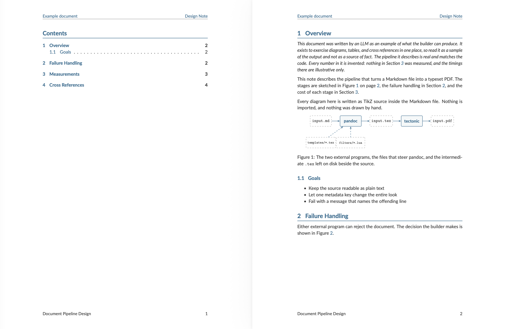

# Template Builder

Sometimes, it's useful to be able to turn plaintext documents into nice looking PDFs. This project does that. You can find an example document [here](example.pdf) associated to [this example markdown file](testdata/example.md).



# Quick Start

This project depends on [go](https://go.dev/), [pandoc](https://pandoc.org/) and [tectonic](https://tectonic-typesetting.github.io/) which can be installed via `make`.

To use this repo, you just download it, install the dependencies, and point it at your file.

```bash
# download the repository
git clone https://github.com/Seth-Rothschild/template_builder.git
cd template_builder

# install the dependencies
make install

# build README.md as a pdf
make oneshot README.md
```

# Server

Running with no arguments starts an HTTP server instead of building a single file.

```bash
make run
```

`PORT` and `TIMEOUT` set the listen port and the request timeout in seconds, defaulting to `8080` and `60`.

## GET /health

Returns 200 once the server is ready to accept builds.

## POST /build

Renders a markdown document and returns the PDF as the response body with `Content-Type: application/pdf`. The request body can be any of three things.

Plain markdown text, which is what you get when no other content type matches:

```bash
curl --data-binary @input.md http://localhost:8080/build -o out.pdf
```

Multipart form data, with a `markdown` text field and one `images` file field for each image the markdown refers to by relative path. Note the `<` rather than `@`, which tells curl to send the file contents as a field instead of as a file upload:

```bash
curl -F 'markdown=<input.md' -F images=@figure.png \
    http://localhost:8080/build -o out.pdf
```

JSON, with a `markdown` string and an `images` array whose objects each hold a `filename` and base64 `data`:

```bash
curl -H 'Content-Type: application/json' \
    -d '{"markdown":"# Hi","images":[]}' \
    http://localhost:8080/build -o out.pdf
```

# Code Map
The Go code splits into a `builder` package which contains the `pandoc` and `tectonic` build steps, and a `main` package that manages inputs and outputs for the build. 

## package main

  - [`main.go`](main.go) runs the HTTP server and gives the local build command. 
  - [`http_helpers.go`](http_helpers.go) unpacks a `/build` request body into a markdown file on disk, handling plain text, multipart form data, and JSON.

## package builder

  - [`builder/build.go`](builder/build.go) contains the `Build` function which converts markdown to PDF.
  - [`builder/environment.go`](builder/environment.go) checks that `pandoc`, `tectonic`, and the template and filter files are all present before anything runs, and wraps external commands with a timeout.
  - [`builder/error_parsing.go`](builder/error_parsing.go) turns noisy `pandoc` and `tectonic` stderr into messages that are easier to read. 

You can control how a document looks by setting a `template_version` in the metadata of your markdown file. You can add new templates into the [templates](./templates) directory.

You can run the HTML docs with `make docs`.
